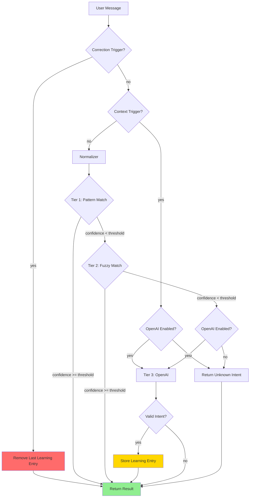
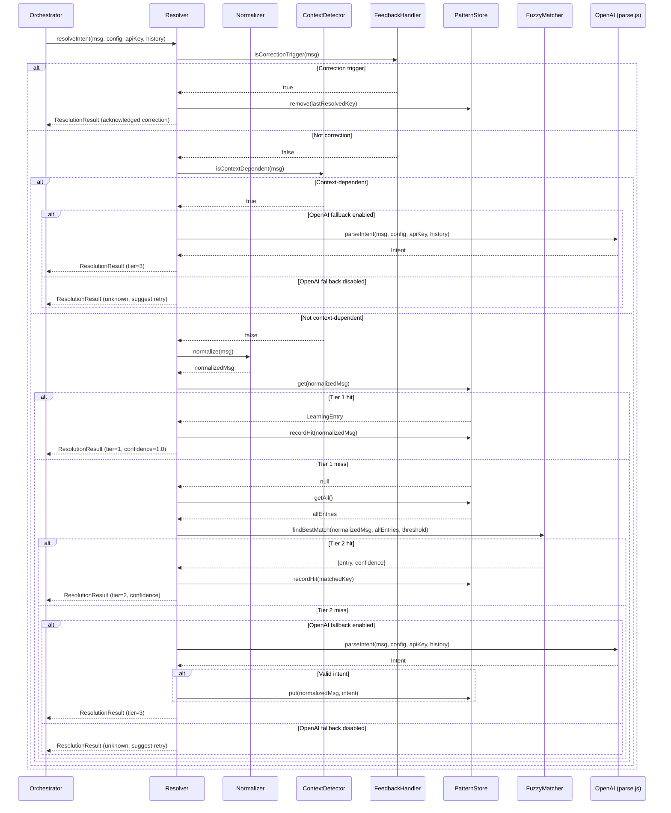

# Design Document: Local Intent Resolver

## Overview

This design introduces a self-learning local intent resolution system for the Tathastu WhatsApp bot. The system sits between the orchestrator and the existing OpenAI-based parser, intercepting user messages and attempting to resolve them locally before falling back to OpenAI. Every successful OpenAI parse is captured and stored, so the system progressively learns and reduces API calls over time.

The architecture follows a pipeline pattern: messages flow through Tier 1 (exact pattern match) → Tier 2 (fuzzy similarity) → Tier 3 (OpenAI fallback), stopping at the first tier that produces sufficient confidence. The system is designed as a drop-in replacement for the existing `parseIntent()` call.

## Architecture



### Key Design Decisions

1. **Pipeline over parallel**: Tiers execute sequentially to minimize compute. Tier 1 is O(1) lookup, Tier 2 scans the pattern store only if Tier 1 misses, and Tier 3 (network call) is the last resort.

2. **Normalization before matching**: All queries are normalized before any tier comparison. This means the Pattern_Store keys are always normalized forms, giving us case/punctuation/transliteration invariance for free.

3. **Debounced persistence**: Pattern store writes are debounced (max once per 5 seconds) to avoid excessive disk I/O on bursts of new learnings, while still ensuring data is persisted promptly.

4. **Context bypass**: Messages that look like follow-ups (numbers, "more", "next", Hindi/Gujarati equivalents) skip local resolution entirely and go straight to OpenAI with conversation history, since these require conversational context that local matching cannot provide.

5. **No external dependencies for matching**: Fuzzy matching uses a simple token-overlap (Jaccard similarity) approach rather than pulling in a heavy NLP library. This keeps the bot lightweight and avoids new dependencies.

## Components and Interfaces

### 1. Resolver (`src/intent/resolver.js`)

The main orchestrator module. Exports `resolveIntent()` as a drop-in replacement for `parseIntent()`.

```javascript
/**
 * @param {string} userMessage - Raw user message text
 * @param {object} config - Bot configuration from loadConfig()
 * @param {string} apiKey - OpenAI API key
 * @param {Array<{role: string, content: string}>} history - Conversation history
 * @returns {Promise<ResolutionResult>}
 */
async function resolveIntent(userMessage, config, apiKey, history) { ... }

/**
 * @returns {Metrics}
 */
function getMetrics() { ... }

/**
 * Export all learned patterns as JSON string.
 * @returns {string}
 */
function exportPatterns() { ... }

/**
 * Import patterns from a JSON string, merging with existing store.
 * @param {string} jsonString
 */
function importPatterns(jsonString) { ... }
```

**ResolutionResult shape:**
```javascript
{
  skillId: string | null,
  action: string,
  params: object,
  suggestedReply: string | null,
  // Extended fields (not passed to orchestrator, used for logging/metrics)
  _tier: 1 | 2 | 3,
  _confidence: number
}
```

### 2. Normalizer (`src/intent/normalizer.js`)

Stateless text normalization module. Loads transliteration mappings from `config/knowledge.md` at startup.

```javascript
/**
 * Normalize a user query for matching.
 * @param {string} text - Raw user input
 * @returns {string} - Normalized text
 */
function normalize(text) { ... }

/**
 * Tokenize a normalized string into a set of tokens.
 * @param {string} normalizedText
 * @returns {Set<string>}
 */
function tokenize(normalizedText) { ... }
```

Normalization steps (in order):
1. Trim and lowercase
2. Remove punctuation: `. , ? ! ; : " ' ( ) [ ] { }`
3. Transliterate known Hindi/Gujarati tokens → English keywords (from knowledge.md mappings)
4. Collapse multiple spaces to single space
5. Final trim

### 3. PatternStore (`src/intent/pattern-store.js`)

Manages the learned pattern database. Handles persistence to `data/intent-patterns.json`.

```javascript
class PatternStore {
  /**
   * @param {string} filePath - Path to the JSON persistence file
   */
  constructor(filePath) { ... }

  /** Load entries from disk. */
  load() { ... }

  /**
   * Exact lookup by normalized key.
   * @param {string} normalizedQuery
   * @returns {LearningEntry | null}
   */
  get(normalizedQuery) { ... }

  /**
   * Get all entries for fuzzy comparison.
   * @returns {Array<{key: string, entry: LearningEntry}>}
   */
  getAll() { ... }

  /**
   * Add or update a learning entry.
   * @param {string} normalizedQuery
   * @param {Intent} intent
   */
  put(normalizedQuery, intent) { ... }

  /**
   * Increment hit count for an existing entry.
   * @param {string} normalizedQuery
   */
  recordHit(normalizedQuery) { ... }

  /** @returns {number} Total number of entries */
  size() { ... }

  /**
   * Remove a learning entry by normalized key.
   * @param {string} normalizedQuery
   * @returns {boolean} - true if entry existed and was removed
   */
  remove(normalizedQuery) { ... }

  /**
   * Export all entries as a JSON string.
   * @returns {string}
   */
  exportJSON() { ... }

  /**
   * Merge imported entries into the store.
   * For duplicate keys, keeps the entry with the higher hitCount.
   * @param {string} jsonString - JSON string of PatternStoreFile format
   * @throws {Error} if JSON is malformed or invalid
   */
  importJSON(jsonString) { ... }
}
```

**LearningEntry shape:**
```javascript
{
  intent: {
    skillId: string,
    action: string,
    params: object,
    suggestedReply: string | null
  },
  hitCount: number,
  createdAt: string,   // ISO 8601 timestamp
  lastUsedAt: string   // ISO 8601 timestamp
}
```

**Persistence file format** (`data/intent-patterns.json`):
```json
{
  "version": 1,
  "entries": {
    "ledger meril": {
      "intent": { "skillId": "tally", "action": "get_ledger", "params": { "party_name": "meril" } },
      "hitCount": 15,
      "createdAt": "2025-01-15T10:30:00Z",
      "lastUsedAt": "2025-01-20T14:22:00Z"
    }
  }
}
```

### 4. FuzzyMatcher (`src/intent/fuzzy-matcher.js`)

Token-based similarity scoring using Jaccard similarity.

```javascript
/**
 * Find the best matching entry from the pattern store.
 * @param {string} normalizedQuery - The normalized user query
 * @param {Array<{key: string, entry: LearningEntry}>} entries - All pattern store entries
 * @param {number} threshold - Minimum confidence threshold
 * @returns {{ entry: LearningEntry, confidence: number } | null}
 */
function findBestMatch(normalizedQuery, entries, threshold) { ... }

/**
 * Compute Jaccard similarity between two token sets.
 * @param {Set<string>} a
 * @param {Set<string>} b
 * @returns {number} - Value between 0.0 and 1.0
 */
function jaccardSimilarity(a, b) { ... }
```

**Jaccard similarity**: `|A ∩ B| / |A ∪ B|` where A and B are token sets from normalized queries. This is simple, fast, and works well for short natural-language queries where word overlap is the primary signal.

### 5. ContextDetector (`src/intent/context-detector.js`)

Detects messages that require conversation context and should bypass local resolution.

```javascript
/**
 * Check if a message requires conversation context.
 * @param {string} text - Raw user message
 * @returns {boolean}
 */
function isContextDependent(text) { ... }
```

Default context-dependent patterns:
- Single digit or small number: `^\d{1,2}$`
- Pagination: `more`, `next`, `next page`, `page \d+`
- Hindi pagination: `aur`, `aur dikhao`, `aage`
- Gujarati pagination: `vadhu`, `aagal`
- Pronouns referencing previous context: `his`, `her`, `their`, `that`, `same`
- Short affirmatives selecting from lists: `yes`, `haan`, `ha`

### 6. FeedbackHandler (`src/intent/feedback-handler.js`)

Handles user correction triggers to remove bad learnings.

```javascript
/**
 * Check if a message is a correction trigger.
 * @param {string} text - Raw user message
 * @param {string[]} triggers - List of correction trigger words
 * @returns {boolean}
 */
function isCorrectionTrigger(text, triggers) { ... }
```

The Resolver tracks the last resolved query's normalized key. When a correction trigger is detected, it removes that key from the PatternStore and persists the change.

### 7. Metrics (`src/intent/metrics.js`)

Simple in-memory counters.

```javascript
class Metrics {
  constructor() {
    this.total = 0;
    this.tier1Hits = 0;
    this.tier2Hits = 0;
    this.tier3Hits = 0;
    this.corrections = 0;
  }

  record(tier) { ... }
  recordCorrection() { ... }

  /** @returns {{ total, tier1Hits, tier2Hits, tier3Hits, corrections, patternCount }} */
  toJSON(patternCount) { ... }
}
```


## Data Models

### Intent

```javascript
{
  skillId: string | null,  // e.g., "tally"
  action: string,          // e.g., "get_ledger", "unknown"
  params: object,          // e.g., { party_name: "Meril" }
  suggestedReply: string | null
}
```

This matches the existing output format of `parseIntent()` in `src/openai/parse.js`, ensuring backward compatibility.

### LearningEntry

```javascript
{
  intent: Intent,
  hitCount: number,        // Starts at 1, incremented on each match
  createdAt: string,       // ISO 8601
  lastUsedAt: string       // ISO 8601, updated on each match
}
```

### PatternStoreFile

```javascript
{
  version: number,         // Schema version, currently 1
  entries: {
    [normalizedQuery: string]: LearningEntry
  }
}
```

The file is a flat JSON object keyed by normalized query strings. This keeps lookups O(1) for Tier 1 and allows simple iteration for Tier 2.

### ResolutionResult

```javascript
{
  // Standard fields (compatible with parseIntent output)
  skillId: string | null,
  action: string,
  params: object,
  suggestedReply: string | null,
  // Extended metadata
  _tier: 1 | 2 | 3,
  _confidence: number      // 0.0 to 1.0
}
```

### Metrics

```javascript
{
  total: number,           // Total queries processed
  tier1Hits: number,       // Resolved by pattern match
  tier2Hits: number,       // Resolved by fuzzy match
  tier3Hits: number,       // Fell back to OpenAI
  patternCount: number     // Total entries in pattern store
}
```

### Transliteration Map

Derived at startup from `config/knowledge.md`. Structure:

```javascript
// Map<string, string> — source token → canonical English keyword
{
  "khata": "ledger",
  "खाता": "ledger",
  "baki": "outstanding",
  "बाकी": "outstanding",
  "bikri": "sales",
  "बिक्री": "sales",
  // ... etc from knowledge.md
}
```

### Configuration Extension

Added to `config/skills.json`:

```javascript
{
  "resolver": {
    "enabled": true,
    "confidenceThreshold": 0.7,
    "patternStorePath": "data/intent-patterns.json",
    "contextPatterns": ["^\\d{1,2}$", "more", "next", "aur dikhao", "aage"],
    "correctionTriggers": ["wrong", "galat", "ખોટું", "ghalat"],
    "openAIFallbackEnabled": true
  }
}
```

### Resolver Pipeline Flow (Detailed)




## Correctness Properties

*A property is a characteristic or behavior that should hold true across all valid executions of a system — essentially, a formal statement about what the system should do. Properties serve as the bridge between human-readable specifications and machine-verifiable correctness guarantees.*

### Property 1: Pipeline ordering

*For any* user message and any pattern store state, the Resolver SHALL try Tier 1 first; if Tier 1's confidence is below the threshold, try Tier 2; if Tier 2's confidence is also below the threshold, invoke Tier 3 (OpenAI). The result SHALL come from the first tier that meets or exceeds the confidence threshold, and no subsequent tiers SHALL be invoked after a successful one.

**Validates: Requirements 1.1, 1.2, 1.3, 1.4, 4.1**

### Property 2: Result structure completeness

*For any* resolution (regardless of which tier resolves it), the returned ResolutionResult SHALL contain non-undefined `skillId`, `action`, `params`, `suggestedReply`, `_tier`, and `_confidence` fields, where `_tier` is one of 1, 2, or 3 and `_confidence` is a number between 0.0 and 1.0.

**Validates: Requirements 1.5, 9.2**

### Property 3: Tier 1 exact match correctness

*For any* normalized query string and any pattern store, Tier 1 returns confidence 1.0 with the stored intent if and only if the normalized query exactly matches a key in the pattern store. If no exact match exists, Tier 1 returns confidence 0.0.

**Validates: Requirements 2.1, 2.2**

### Property 4: Hit count increment on match

*For any* pattern store entry that is matched (by Tier 1 or Tier 2), the entry's hitCount after the match SHALL equal its hitCount before the match plus 1, and its lastUsedAt timestamp SHALL be updated.

**Validates: Requirements 2.3**

### Property 5: Fuzzy match best-selection

*For any* normalized query and pattern store with multiple entries above the confidence threshold, the FuzzyMatcher SHALL return the entry with the highest Jaccard similarity score. When two entries have equal similarity scores, the entry with the higher hitCount SHALL be selected.

**Validates: Requirements 3.2, 3.3, 3.4**

### Property 6: Learning entry storage correctness

*For any* OpenAI result, a new LearningEntry is stored in the PatternStore if and only if the result has a non-null skillId and an action other than "unknown". New entries SHALL have hitCount initialized to 1. If an entry already exists for the normalized query, the existing entry's intent SHALL be updated, its hitCount incremented, and its lastUsedAt timestamp refreshed — without creating a duplicate.

**Validates: Requirements 4.2, 4.3, 4.4, 4.5**

### Property 7: Normalization correctness

*For any* input string, the Normalizer output SHALL be lowercase, contain no punctuation characters (`. , ? ! ; : " ' ( ) [ ] { }`), contain no consecutive whitespace characters, have no leading or trailing whitespace, and have all known Hindi/Gujarati tokens replaced with their canonical English keywords.

**Validates: Requirements 5.1, 5.2, 5.3, 5.4**

### Property 8: Normalization idempotence

*For any* input string, `normalize(normalize(input))` SHALL produce the same result as `normalize(input)`. That is, normalizing an already-normalized string is a no-op.

**Validates: Requirements 5.5**

### Property 9: Pattern store round-trip persistence

*For any* set of LearningEntries written to the PatternStore, loading a new PatternStore instance from the same file SHALL produce an equivalent set of entries (same keys, same intents, same hitCounts, same timestamps).

**Validates: Requirements 6.1, 6.2**

### Property 10: Metrics counter invariant

*For any* sequence of resolved queries, `metrics.total` SHALL equal `metrics.tier1Hits + metrics.tier2Hits + metrics.tier3Hits` at all times.

**Validates: Requirements 8.1**

### Property 11: Context-dependent bypass

*For any* message that matches a context-dependent trigger pattern, the Resolver SHALL route directly to Tier 3 (OpenAI) without attempting Tier 1 or Tier 2, and the result SHALL have `_tier` equal to 3.

**Validates: Requirements 10.1, 10.3**

### Property 12: Jaccard similarity bounds

*For any* two token sets A and B, `jaccardSimilarity(A, B)` SHALL return a value in the range [0.0, 1.0]. When A equals B (and both are non-empty), the result SHALL be 1.0. When A and B have no common tokens, the result SHALL be 0.0.

**Validates: Requirements 3.2** (mathematical foundation for fuzzy matching)

### Property 13: Confidence threshold validation

*For any* configured confidence threshold value in the range [0.0, 1.0], the Resolver SHALL use that value. For any value outside this range, the Resolver SHALL fall back to the default of 0.7.

**Validates: Requirements 7.3, 7.4**

### Property 14: Correction trigger removes learning entry

*For any* correction trigger message sent immediately after a resolved query, the PatternStore SHALL no longer contain the Learning_Entry for the last resolved query's normalized key. The PatternStore size SHALL decrease by 1 if the entry existed.

**Validates: Requirements 10.1, 10.3**

### Property 15: OpenAI fallback disabled prevents API calls

*For any* message that fails Tier 1 and Tier 2 resolution, when `openAIFallbackEnabled` is `false`, the Resolver SHALL return an unknown intent without invoking OpenAI, and no new Learning_Entry SHALL be created.

**Validates: Requirements 11.2, 11.3**

### Property 16: Import/export round-trip

*For any* PatternStore with a set of Learning_Entries, exporting to JSON and then importing that JSON into an empty PatternStore SHALL produce an equivalent set of entries (same keys, same intents, same hitCounts).

**Validates: Requirements 12.1, 12.2, 12.4**

### Property 17: Import merge keeps higher hit count

*For any* two PatternStores with overlapping keys, importing one into the other SHALL keep the entry with the higher hitCount for each overlapping key, and add all non-overlapping entries from the import.

**Validates: Requirements 12.3, 12.4**

## Error Handling

| Scenario | Handling |
|---|---|
| Pattern store JSON file missing at startup | Initialize empty store, create file on first write (Req 6.3) |
| Pattern store JSON file corrupted/unparseable | Log warning, initialize empty store, overwrite on next write (Req 6.5) |
| Confidence threshold out of range [0.0, 1.0] | Log warning, use default 0.7 (Req 7.4) |
| OpenAI API call fails (network error, timeout) | Propagate error to orchestrator (same behavior as current `parseIntent`) |
| OpenAI returns unparseable response | Return `{ skillId: null, action: "unknown", params: {}, suggestedReply: null }` — do NOT store a learning entry |
| Pattern store file write fails (disk full, permissions) | Log error, keep in-memory state intact, retry on next debounce cycle |
| Empty user message | Return unknown intent immediately, do not store |
| Normalizer encounters unknown Unicode characters | Pass through unchanged (only known Hindi/Gujarati tokens are transliterated) |

## Testing Strategy

### Testing Framework

- **Unit tests**: Node.js built-in `assert` module (consistent with existing test files in `src/skills/tally/tests/`)
- **Property-based tests**: `fast-check` library — lightweight, zero-dependency PBT library for JavaScript
- Install: `npm install --save-dev fast-check`

### Dual Testing Approach

**Unit tests** cover:
- Specific examples from the knowledge base (e.g., "khata meril" → get_ledger)
- Edge cases: empty strings, corrupted JSON files, out-of-range thresholds
- Integration: orchestrator wiring with resolver enabled/disabled
- Context detection for specific patterns

**Property-based tests** cover:
- Universal properties (Properties 1–13 above) across randomly generated inputs
- Each property test runs a minimum of 100 iterations
- Each test is tagged with its property reference

### Property Test Tags

Each property-based test MUST include a comment tag:
```javascript
// Feature: local-intent-resolver, Property N: <property title>
```

### Test File Organization

```
src/intent/tests/
  test-normalizer.js       — Unit + property tests for Normalizer
  test-pattern-store.js    — Unit + property tests for PatternStore
  test-fuzzy-matcher.js    — Unit + property tests for FuzzyMatcher
  test-context-detector.js — Unit tests for ContextDetector
  test-feedback-handler.js — Unit tests for FeedbackHandler
  test-resolver.js         — Integration + property tests for Resolver pipeline
  test-metrics.js          — Unit + property tests for Metrics
```

### Property-to-Test Mapping

| Property | Test File | Type |
|---|---|---|
| P1: Pipeline ordering | test-resolver.js | Property (mock OpenAI) |
| P2: Result structure | test-resolver.js | Property |
| P3: Tier 1 exact match | test-pattern-store.js | Property |
| P4: Hit count increment | test-pattern-store.js | Property |
| P5: Fuzzy best-selection | test-fuzzy-matcher.js | Property |
| P6: Learning entry storage | test-resolver.js | Property (mock OpenAI) |
| P7: Normalization correctness | test-normalizer.js | Property |
| P8: Normalization idempotence | test-normalizer.js | Property |
| P9: Pattern store round-trip | test-pattern-store.js | Property |
| P10: Metrics counter invariant | test-metrics.js | Property |
| P11: Context-dependent bypass | test-resolver.js | Property |
| P12: Jaccard similarity bounds | test-fuzzy-matcher.js | Property |
| P13: Confidence threshold validation | test-resolver.js | Property |
| P14: Correction trigger removes entry | test-resolver.js | Property |
| P15: OpenAI fallback disabled | test-resolver.js | Property |
| P16: Import/export round-trip | test-pattern-store.js | Property |
| P17: Import merge keeps higher hit count | test-pattern-store.js | Property |
